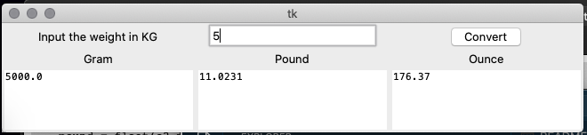

# Weight Converter Gram to Pounds to Ounce

Weight conversion means to multiply the value of a unit with the standard conversion value. 

The standard weight conversion values include:

1 milligram = 0.001 gram
1 centigram = 0.01 gram
1 decigram = 0.1 gram
1 kilogram = 1000 grams
1 gram = 1000 milligrams
1 ton = 2000 pounds
1 pound = 16 ounces

## GUI of the App

